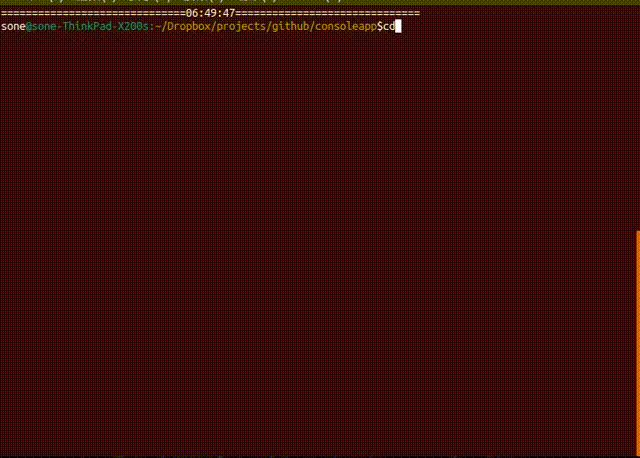
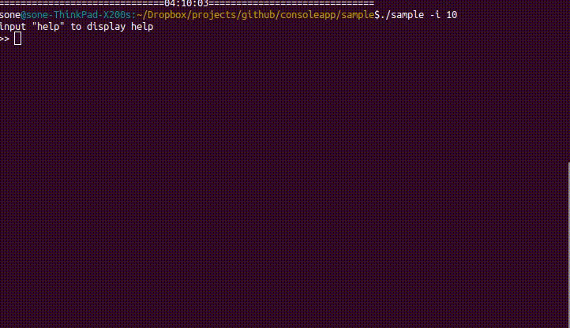
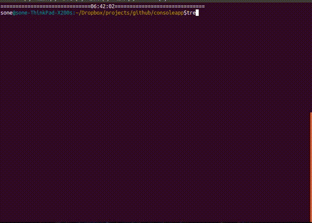

# libconsoleapp.a
The libconsoleapp.a is a C library.
This library aim to provide general-purpose and flexible functions of the console application and to prepare for its development.  
Currently, this library can be useful for implementing the following two functions in the console app.  

1. Classification and error check of options received at startup.
2. Implementation of interactive function.

Hereafter, the function of 1 is called **consoleapp/option**, and the function of 2 is called **consoleapp/prompt**.  
**consoleapp/option** is implemented in option.c and option.h. **consoleapp/prompt** is implemented in prompt.c and prompt.h.

# consoleapp/option
**consoleapp/option** makes it easy to classification and error check of options received at startup.

## Struct reference

```c:option.h
/* プログラムで使用できるオプションの情報を保持する構造体 */
typedef struct _opt_property_t{
    char *short_form;                                           /* オプションの短縮形式. 例えば"-v" */
    char *long_form;                                            /* オプションの詳細形式. 例えば"--version" */
    int  (*contents_checker)(char **contents, int content_num); /* オプションに付属するcontentsの正しさを調べるコールバック関数 */
    int  content_num_min;                                       /* オプションに付属するcontentsの最小数 */
    int  content_num_max;                                       /* オプションに付属するcontentsの最大数 */
    int  appeared_yet;                                          /* 同じオプションがすでに指定されたかチェックするためのメモとして用いる */
}opt_property_t;
```

```c:option.h
/* opt_property_tのエントリを保持するための構造体 */
typedef struct _opt_property_db_t{
    int             prop_num; /* propsのサイズ */
    opt_property_t *props;    /* opt_property_tの配列 */
}opt_property_db_t;
```

```c:option.h
/* プログラム実行時に指定した各オプションの情報を保持するための構造体 */
typedef struct _opt_group_t{
    char  *option;        /* 例えば "gcc -Wall -O3 -I ./hoge ./geho -o ./foo bar1.c bar2.c" の -Wall, -O3, -I, -o がそれぞれ別のopt_group_tのoptionに割り当てられる */
    int    content_num;   /* 例えば option が -I なら2になる */
    char **contents;      /* 例えば option が -I なら ./hoge, ./geho になる */
    int    err_code;      /* 対応するopt_property_tに登録されているcontents_checker関数の引数にcontent_numとcontentsを適用した際の戻り値  */
}opt_group_t;
```

```c:option.h
/* opt_group_tのエントリを保持するための構造体 */
typedef struct _opt_group_db_t{
    int          grp_num;    /* opt_group_tの配列のサイズ */
    opt_group_t *grps;       /* opt_group_tの配列 */
    int         optless_num; /* 対応するオプションが無いコンテンツの数 */
    char      **optless;     /* 対応するオプションが無いコンテンツ. 例えば, gcc -o hoge hoge.c geho.c のhoge.cとgeho.c */
}opt_group_db_t;
```

## Function reference
```c:option.h
extern opt_property_db_t* /* 生成されたopt_property_db_tのメモリ領域のポインタ */
genOptPropDB(     
        int prop_num); /* 登録するopt_property_tの数 */
```

```c:option.h
extern int /* option_errcode_tのどれか */
regOptProp( /* opt_property_db_tのエントリを追加する関数 */
        opt_property_db_t  *db,             /* [out] 登録先(genOptPropDBで作成したopt_property_db_t) */
        char               *short_form,     /* [in] オプションの短縮形式 */
        char               *long_form,      /* [in] オプションの詳細形式 */
        int                content_num_min, /* オプションに付属するコンテンツの最少数 */
        int                content_num_max, /* オプションに付属するコンテンツの最大数 */
        int              (*contents_checker)(char **contents, int content_num)); /* オプションのコンテンツをチェックするコールバック関数 */
```

```c:option.h
extern void
freeOptPropDB( /* opt_property_db_tのメンバのメモリ領域を再帰的に開放する関数 */
        opt_property_db_t *db); /* [in] 開放するopt_property_db_t */
```

```c:option.h
extern int /* option_errcode_tのどれか */
groupingOpt( /* オプション情報が登録されたopt_property_dbをもとにmainの引数で取得したargcとargvをグループに分類してopt_group_db_tのエントリに登録する関数 */
        opt_property_db_t *opt_prop_db,  /* [in] オプション情報が登録されたopt_property_db_t */
        int                argc,         /* mainの引数で受け取ったプログラムの引数の数(プログラム名含む) */
        char             **argv,         /* [in] mainの引数で受け取ったプログラムの引数(プログラム名含む) */
        opt_group_db_t   **opt_grp_db);  /* [out] グルーピングされたオプション情報 */
```

```c:option.h
extern void
freeOptGroupDB( /* opt_group_db_tのメンバのメモリ領域を再帰的に解放 */
        opt_group_db_t *opt_group_db); /* [in] 開放するopt_group_db_t */
```

## Sample code
This it a part of "sample/sample.c".
```c
int main(int argc, char *argv[]){

    opt_property_db_t *opt_prop_db = genOptPropDB(4);
    opt_group_db_t    *opt_grp_db   = NULL;
    int                ret;

    regOptProp(opt_prop_db, "-h", "--help",        0,       0, NULL);
    regOptProp(opt_prop_db, "-v", "--version",     0,       0, NULL);
    regOptProp(opt_prop_db, "-p", "--print",       1, INT_MAX, NULL);
    regOptProp(opt_prop_db, "-i", "--interactive", 1,       1, chkOptInteractive);

    ret = groupingOpt(opt_prop_db, argc, argv, &opt_grp_db);

#if DEBUG
    debugInfo1(ret, opt_grp_db);
#endif

    switch(ret){
        case OPTION_SUCCESS: /* success */
            break;

        case OPTION_OPT_NAME_IS_NULL:
            fprintf(stderr, "error: out of memory\n");
            exit(1);

        case OPTION_OUT_OF_MEMORY:
            fprintf(stderr, "error: flag_prop_db is null\n");
            exit(1);

        case OPTION_DUPLICATE_SAME_OPT:
            fprintf(stderr, "error: duplicate same flag\n");
            exit(1);

        case OPTION_TOO_MANY_CONTENTS:
            fprintf(stderr, "error: too many contents\n");
            exit(1);

        case OPTION_TOO_LITTLE_CONTENTS:
            fprintf(stderr, "error: too little contents\n");
            exit(1);

        default:
            fprintf(stderr, "there is a bug! (line: %d)\n", __LINE__);
            exit(100);
    }

    for(int i=0; i<opt_grp_db->grp_num; i++){
        switch(opt_grp_db->grps[i].err_code){
            case 0: /* success */
                break;

            case 1: 
                fprintf(stderr, "error: the history size \"%s\" specified with the option \"%s\" is an invalid value\n", opt_grp_db->grps[i].contents[0], opt_grp_db->grps[i].option);
                exit(2);
                break;

            default:
                fprintf(stderr, "error: there is a bug! (line: %d)\n", __LINE__);
                exit(100);
        }
    }

    for(int i=0;i<opt_grp_db->grp_num;i++){
        char *flag       = opt_grp_db -> grps[i].option;
        char **contents  = opt_grp_db -> grps[i].contents;
        int  content_num = opt_grp_db -> grps[i].content_num;

        if(strcmp(flag, "-h") == 0 || strcmp(flag, "--help") == 0){
            printUsage();
        }
        else if(strcmp(flag, "-v") == 0 || strcmp(flag, "--version") == 0){
            printVersion();
        }
        else if(strcmp(flag, "-p") == 0 || strcmp(flag, "--print") == 0){
            for(int i=0; i<content_num; i++){
                printf("%s\n", contents[i]);
            }
        }
        else if(strcmp(flag, "-i") == 0 || strcmp(flag, "--interactive") == 0){
            interactive(atoi(contents[0]));
        }
    }

    return 0;
}
```

This is a part of "sample/for_option.c".
```c:for_opton.c
int chkOptInteractive(char **contents, int dont_care){
    const int SUCCESS        = 0;
    const int ILLIGAL_NUMBER = 1;

    int num = atoi(contents[0]);
    if(num < 1){
        return ILLIGAL_NUMBER;
    }
    return SUCCESS;
}
```
## Demo


# consoleapp/prompt
**consoleapp/prompt** makes it easy to implementation of interactive function.

## Struct reference
The most important structure is rwhctx_t, and structures other than rwhctx_t are defined for rwhctx_t.

```c:prompt.h
/* structure for ring buffer. this is used for rwh_ctx_t's member. there is no need for user to know. */
typedef struct _ringbuf_t{
    char **buf;         /* buffer for entories */
    int    size;        /* max size of buffer */
    int    head;        /* buffer index at an oldest entory */
    int    tail;        /* buffer index at an newest entory */
    int    entory_num;  /* number of entories */
}ringbuf_t;
```

```c:prompt.h
/* structure for holding candidates at completion. */
typedef struct _completion_t{
    char** entories;   /* entories are sorted in ascending order */
    int    entory_num; /* number of entories */
}completion_t;
```

```c:primpt.h
/* structure for preserve context for rwh(). */
typedef struct _rwhctx_t{
    const char   *prompt;        /* prompt */
    ringbuf_t    *history;       /* history of lines enterd in the console */
    completion_t *candidate;     /* search target at completion */
    char         *sc_head;       /* shortcut for go to the head of the line */
    char         *sc_tail;       /* shortcut for go to the tail of the line */
    char         *sc_next_block; /* shortcut for go to the next edge of the word of the line */
    char         *sc_prev_block; /* shortcut for go to the previous edge of the word of the line */
    char         *sc_completion; /* shortcut for completion */
    char         *sc_dive_hist;  /* shortcut for fetch older history */
    char         *sc_float_hist; /* shortcut for fetch newer history */
}rwhctx_t;
```

## Function reference
The most important function is rwh(), and functions other than rwh() are defined for rwh().  
Incidentary, rwh is short form of Readline With History. However, complementary function was added in the development process.

```c:prompt.h
extern completion_t* /* NULL if fails */
genCompletion( /* generate a completion_t */
        const char **strings,      /* [in] search target at completion */
        int          string_num);  /* number of candidate */
```

```c:prompt.h
extern rwhctx_t* /* a generated rwh_ctx_t pointer which shortcut setting fields are set to default. if failed, it will be NULL. */
genRwhCtx( /* generate a rwh_ctx_t pointer. */
        const char  *prompt,         /* [in] prompt */
              int    history_size,   /* max size of the buffer of the history */
        const char **candidates,     /* [in] search target at completion */ 
              int    candidate_num); /* number of candidates */
```

```c:prompt.h
extern char * /* enterd line */
rwh( /* acquire the line entered in the console and keep history. */
        rwhctx_t   *ctx);      /* [mod] an context generated by genRwhCtx(). ctx keeps shortcuts and history operation keys settings and history. after rwh(), the entories of history of ctx is updated. */
```

```c:prompt.h
extern void
freeRwhCtx( /* free rwhctx_t pointer recursively. */
        rwhctx_t *ctx); /* [mod] to be freed */
```


## Sample code
This is a part of "sample/sample.c". The flow of the Program is,

1. make context of rwhctx\_t for mode1.
2. make context of rwhctx\_t for mode2.
3. get line from prompt by rwh() with current mode context.
4. Perform processing corresponding to the content of acquired line.

```c
void interactive(int hist_entory_size){
    char     *line;
    int       mode = 1;

    const char *commands1[] = {"help", "quit", "ctx", "modctx", "!echo", "!ls", "!pwd", "!date", "!ls -a", "!ls -l", "!ls -lt"};
    const char *commands2[] = {"help", "ctx", "head", "tail", "next block", "prev block", "completion", "dive hist", "float hist", "done"};

    /* here!!! 1 */
    rwhctx_t *ctx1 = genRwhCtx("sample$ "       , hist_entory_size, commands1, sizeof(commands1)/sizeof(char *));
    /* here!!! 2 */
    rwhctx_t *ctx2 = genRwhCtx("modctx@sample$ ", hist_entory_size, commands2, sizeof(commands2)/sizeof(char *));

    printf("input \"help\" to display help\n");

    while(1){
        switch(mode){
            case 1:
                /* here!!! 3 */
                line = rwh(ctx1);

                /* here!!! 4 */
                if(strcmp(line, "help") == 0){
                    interactiveHelp1();
                }
                else if(strcmp(line, "ctx") == 0){
                    interactivePrintCtx(ctx1);
                }
                ** Abb **
                else{
                    printf("err\n");
                }
                break;

            case 2:
                /* here!!! 3 */
                line = rwh(ctx2);

                /* here!!! 4 */
                if(strcmp(line, "help") == 0){
                    interactiveHelp2();
                }
                else if(strcmp(line, "ctx") == 0){
                    interactivePrintCtx(ctx2);
                }
                ** Abb **
                else{
                    printf("err\n");
                }
                break;
        }
    }

free_and_exit:
    freeRwhCtx(ctx1);
    freeRwhCtx(ctx2);
}
```

## Demo


## installation
Please read Makefile. Introduction of autotools is under consideration.

<!--  -->


## Documentation
### Todo
I've written or not written in [doc/TODO.md](doc/TODO.md), bugs, idea, and anything else that I can not remember.

### Contoributer
Contributor is managed with [doc/CONTRIBUTER.md](doc/CONTRIBUTER.md). Please describe it freely in this file, if you commit.

### Copyright
We are proceeding with development under the MIT license. When you want to use the deliverables of this project, you can use it without permission. For details, please see the [doc/COPYRIGHT](doc/COPYRIGHT).
