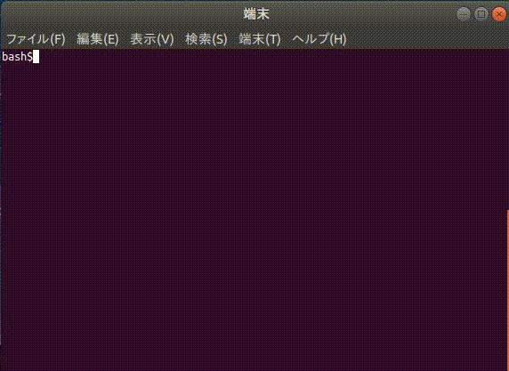

# Introduction
This project aim to provide general and flexible functions of the console application and making it easy to its development.  
Currently, **consoleapp** provides two libraries which can be useful for implementing the following two functions in the console app.  

1. Classification and error check of options received at startup.
2. Implementation of interactive function.

The function of 1 is provided by **liboption.a**, and the function of 2 is provided by **libprompt.a**.  

# Specification of liboption.a
**liboption.a** makes it easy to classification and error check of options received at startup.

## Struct reference

```c:option.h
/* structure for holding information on each option specified at program execution */
typedef struct _opt_group_t{
    unsigned int priority;    /* a unique number corresponding to option */
    int          content_num; /* number of elements of content */
    char       **contents;    /* content attached to options. for example, For example, 1 and 2 in "somecommand - foo = 1, 2 bar" are assigned to the contents [0] and contents [1] of the foo option. */
}opt_group_t;
```

## Function reference
```c:option.h
extern int /* OPTION_SUCCESS or OPTION_FAILURE */
regOptProperty( /*  */
        unsigned int priority,        /* order of options to be extracted by popOptGroup (priority) */
        const char *short_form,      /* [in] short format of option, for example, -h. */
        const char *long_form,       /* [in] long format of option. for example, --help. */
        int          content_num_min, /* minimum number of contents attached to option */
        int          content_num_max, /* maximum number of contents attached to option */
        int        (*contentsChecker)(char **contents, int content_num)); /* callback function to check option contents */
```

```c:option.h
extern int /* OPTION_SUCCESS or OPTION_FAILURE */
groupingOpt( /* function which grouping options by option information registered in regOptionProperty and arguments of main obtained from cli. */
        int     argc,        /* first argument of main */
        char   *argv[],      /* second argument of main */
        int    *optless_num, /* [out] strings of argv which not belonging to any option */
        char ***optless);    /* [out] number of elements of optless_num */
```

```c:option.h
extern opt_group_t* /* a pointer to opt_group_t generated by groupingOpt, or NULL if it exceeds size. */
popOptGroup(void); /* a function that returns a pointer to opt_group_t generated by groupingOpt The order of the pointers to return opt_group_t depends on the priority registered in regOptionProperty. */
```

```c:option.h
extern int  /* the value of the error code. When the first OPTION_SUCCESS is returned, all error codes obtained by this function become OPTION_SUCCESS. */
popOptErrcode(void); /* a function that returns the error code obtained by adapting the contentsChecker registered with regOptionProperty to each option.The order of return depends on the priority registered in regOptionProperty. */
```

```c:option.h
extern void
endOptAnalization(void); /* function to release all dynamic memory secured by consoleapp/option */
```

## Sample code
This is `main()` of *"sample/sample_option.c"*. The flow of the Program is,

1. register option properties by `regOptProperty()`.
2. grouping strings received from cli to each options or does not belong to any options by `gtoupingOpt()`.
3. determine whether an obvious error occurred while analizating options. if error has occurred, display error details by `option_errno` and `option_errmsg`.
4. determine whether a user definition error occurred while analizating option by `popOptErrcode()`. if error has occurred, display error details.
5. pop specified options in decscending order of priority by `popOptGroup()`, and perform processing according to its contents.

```c:sample.c
int main(int argc, char *argv[]){

    int    optless_num = 0;
    char **optless     = NULL;
    int    ret         = OPTION_SUCCESS;

    regOptProperty(HELP,    "-h", "--help",    0, 0,       NULL);
    regOptProperty(VERSION, "-v", "--version", 0, 0,       NULL);
    regOptProperty(PRINT,   "-p", "--print",   1, INT_MAX, NULL);
    regOptProperty(ADD,     "-a", "--add",     2, 2,       areNumber);
    regOptProperty(SUB,     "-s", "--sub",     2, 2,       areNumber);
    regOptProperty(MUL,     "-m", "--mul",     2, 2,       areNumber);
    regOptProperty(DIV,     "-d", "--div",     2, 2,       areNumber);

    if(groupingOpt(argc, argv, &optless_num, &optless) == OPTION_FAILURE){
        fprintf(stderr, "option error: %s\n", option_errmsg);
        ret = option_errno + OPTION_ERR_BASE;
        goto free_and_exit;
    }

    ret = popOptErrcode();
    switch(ret){
        case ARE_NUMBER_ERR:
            ret += USR_DEFINITION_ERR_BASE;
            fprintf(stderr, "option error: not a number\n");
            goto free_and_exit;

        default:
            break;
    }

    opt_group_t *opt_grp_p = NULL;
    while((opt_grp_p = popOptGroup()) != NULL){
        switch(opt_grp_p -> priority){
            case HELP:
                printUsage();
                break;

            case VERSION:
                printVersion();
                break;

            case PRINT:
                for(int i=0; i<opt_grp_p->content_num; i++){
                    printf("%s\n", opt_grp_p->contents[i]);
                }
                break;

            case ADD:
                {
                    int a = atoi(opt_grp_p->contents[0]);
                    int b = atoi(opt_grp_p->contents[1]); 
                    printf("%d + %d = %d\n", a, b, a+b);
                }
                break;

            case SUB:
                {
                    int a = atoi(opt_grp_p->contents[0]);
                    int b = atoi(opt_grp_p->contents[1]); 
                    printf("%d - %d = %d\n", a, b, a-b);
                }
                break;

            case MUL:
                {
                    int a = atoi(opt_grp_p->contents[0]);
                    int b = atoi(opt_grp_p->contents[1]); 
                    printf("%d * %d = %d\n", a, b, a*b);
                }
                break;

            case DIV:
                {
                    int a = atoi(opt_grp_p->contents[0]);
                    int b = atoi(opt_grp_p->contents[1]); 
                    printf("%d / %d = %d\n", a, b, a/b);
                }
                break;

            default:
                fprintf(stderr, "error: there is a bug at %d in %s\n", __LINE__, __FILE__);
                break;
        }
    }

    if(optless != NULL){
        printf("these optionless contents are ignored in this sample.\n");
        for(int i=0; i<optless_num; i++){
            printf("%s, ", optless[i]);
        }
        printf("\b\b \n");
    }

free_and_exit:
    endOptAnalization();
    return ret;
}
```

## Demo
**NOTE: this is an old version demo.**  



# Specification of libprompt.a
**libprompt.a** makes it easy to implementation of interactive function.

## Struct reference
The most important structure is rwhctx_t, and structures other than rwhctx_t are defined for rwhctx_t.

```c:prompt.h
/* structure for ring buffer. this is used for rwh_ctx_t's member. there is no need for user to know. */
typedef struct _ringbuf_t{
    char **buf;         /* buffer for entories */
    int    size;        /* max size of buffer */
    int    head;        /* buffer index at an oldest entory */
    int    tail;        /* buffer index at an newest entory */
    int    entory_num;  /* number of entories */
}ringbuf_t;
```

```c:prompt.h
/* structure for holding candidates at completion. */
typedef struct _completion_t{
    char** entories;   /* entories are sorted in ascending order */
    int    entory_num; /* number of entories */
}completion_t;
```

```c:primpt.h
/* structure for preserve context for rwh(). */
typedef struct _rwhctx_t{
    const char   *prompt;        /* prompt */
    ringbuf_t    *history;       /* history of lines enterd in the console */
    completion_t *candidate;     /* search target at completion */
    char         *sc_head;       /* shortcut for go to the head of the line */
    char         *sc_tail;       /* shortcut for go to the tail of the line */
    char         *sc_next_block; /* shortcut for go to the next edge of the word of the line */
    char         *sc_prev_block; /* shortcut for go to the previous edge of the word of the line */
    char         *sc_completion; /* shortcut for completion */
    char         *sc_dive_hist;  /* shortcut for fetch older history */
    char         *sc_float_hist; /* shortcut for fetch newer history */
}rwhctx_t;
```

## Function reference
The most important function is rwh(), and functions other than rwh() are defined for rwh().  
Incidentary, rwh is short form of Readline With History. However, complementary function was added in the development process.

```c:prompt.h
extern completion_t* /* NULL if fails */
genCompletion( /* generate a completion_t */
        const char **strings,      /* [in] search target at completion */
        int          string_num);  /* number of candidate */
```

```c:prompt.h
extern rwhctx_t* /* a generated rwh_ctx_t pointer which shortcut setting fields are set to default. if failed, it will be NULL. */
genRwhCtx( /* generate a rwh_ctx_t pointer. */
        const char  *prompt,         /* [in] prompt */
              int    history_size,   /* max size of the buffer of the history */
        const char **candidates,     /* [in] search target at completion */ 
              int    candidate_num); /* number of candidates */
```

```c:prompt.h
extern char * /* enterd line */
rwh( /* acquire the line entered in the console and keep history. */
        rwhctx_t   *ctx);      /* [mod] an context generated by genRwhCtx(). ctx keeps shortcuts and history operation keys settings and history. after rwh(), the entories of history of ctx is updated. */
```

```c:prompt.h
extern void
freeRwhCtx( /* free rwhctx_t pointer recursively. */
        rwhctx_t *ctx); /* [mod] to be freed */
```


## Sample code
This is all of *"sample/sample_prompt.c"*. The flow of the Program is,

1. make context of rwhctx\_t by `genRwhCtx()`.
2. get line from prompt by `rwh()` with context.
3. perform processing corresponding to the content of acquired line.

```c
#include <stdio.h>
#include <string.h>
#include "../src/prompt.h"

#define COMMANDS_SIZE 4
#define HISTORY_SIZE  10

int main(void){

    rwhctx_t *ctx  = NULL;
    char     *line = NULL;

    const char *commands[COMMANDS_SIZE] = {
        "help",
        "version",
        "ctx",
        "quit",
    };

    ctx = genRwhCtx("sample_prompt$", HISTORY_SIZE, commands, COMMANDS_SIZE);

    while(1){
        line = rwh(ctx);
        if(strcmp(line, "help") == 0){
            printf("help:    print this help\n");
            printf("version: print version of libprompt.a\n");
            printf("ctx:     print \"rwhctx_t *ctx\" info\n");
            printf("quit:    quit\n");
        }
        else if(strcmp(line, "version") == 0){
            printf("version: %s\n", CONSOLEAPP_PROMPT_VERSION);
        }
        else if(strcmp(line, "ctx") == 0){
            printf("history: \n");
            printf(" ↑ old\n");
            for(int i=0; i<ctx->history->entory_num; i++){
                printf("    %s\n", ctx->history->buf[i]);
            }
            printf(" ↓ new\n");
            printf("candidate: \n");
            for(int i=0; i<ctx->candidate->entory_num; i++){
                printf("    %s\n", ctx->candidate->entories[i]);
            }
            printf("sc_head: %s\n", ctx->sc_head);
            printf("sc_tail: %s\n", ctx->sc_tail);
            printf("sc_next_block: %s\n", ctx->sc_next_block);
            printf("sc_prev_block: %s\n", ctx->sc_prev_block);
            printf("sc_completion: %s\n", ctx->sc_completion);
            printf("sc_dive_hist: %s\n", ctx->sc_dive_hist);
            printf("sc_float_hist: %s\n", ctx->sc_float_hist);
        }
        else if(strcmp(line, "quit") == 0){
            break;
        }
        else{
            fprintf(stderr, "error\n");
        }
    }

    freeRwhCtx(ctx);
    return 0;
}
```

## Demo
**NOTE: this is an old version demo.**  


## Installation

Watch [doc/INSTALL.md](doc/INSTALL.md)

## Documentation
### Todo
I've written or not written in [doc/TODO.md](doc/TODO.md), bugs, idea, and anything else that I can not remember.

### Contoributer
Contributor is managed with [doc/CONTRIBUTER.md](doc/CONTRIBUTER.md). Please describe it freely in this file, if you commit.

### Copyright
We are proceeding with development under the MIT license. When you want to use the deliverables of this project, you can use it without permission. For details, please see the [doc/COPYRIGHT](doc/COPYRIGHT).
